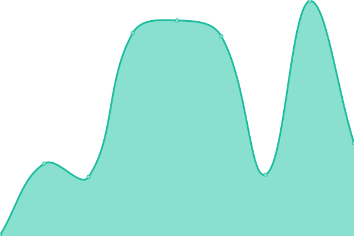
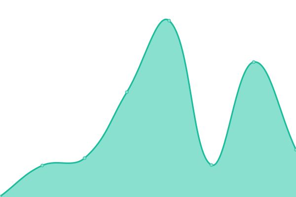
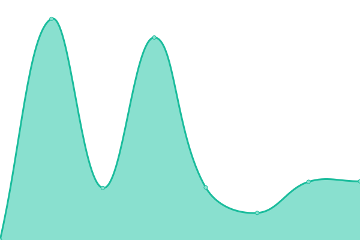

# [📈 Live Status](https://tshirtventures.github.io/uptime): <!--live status--> **🟩 All systems operational**

This repository contains the open-source uptime monitor and status page for [T-shirt Ventures](https://tshirtventures.com.au), powered by [Upptime](https://github.com/upptime/upptime).

With [Upptime](https://upptime.js.org), you can get your own unlimited and free uptime monitor and status page, powered entirely by a GitHub repository. We use [Issues](https://github.com/tshirtventures/uptime/issues) as incident reports, [Actions](https://github.com/tshirtventures/uptime/actions) as uptime monitors, and [Pages](https://tshirtventures.github.io/uptime) for the status page.

<!--start: status pages-->
<!-- This summary is generated by Upptime (https://github.com/upptime/upptime) -->
<!-- Do not edit this manually, your changes will be overwritten -->
<!-- prettier-ignore -->
| URL | Status | History | Response Time | Uptime |
| --- | ------ | ------- | ------------- | ------ |
|  [Provider Choice](https://providerchoice.com.au) | 🟩 Up | [provider-choice.yml](https://github.com/tshirtventures/uptime/commits/HEAD/history/provider-choice.yml) | 

 55ms
     
 | 

<a href="https://tshirtventures.github.io/uptime/history/provider-choice">100.00%</a>
    

|  [Provider Choice - App](https://app.providerchoice.com.au) | 🟩 Up | [provider-choice-app.yml](https://github.com/tshirtventures/uptime/commits/HEAD/history/provider-choice-app.yml) | 

 930ms
     
 | 

<a href="https://tshirtventures.github.io/uptime/history/provider-choice-app">100.00%</a>
    

|  [HeyHubble](https://heyhubble.com.au) | 🟩 Up | [hey-hubble.yml](https://github.com/tshirtventures/uptime/commits/HEAD/history/hey-hubble.yml) | 

 62ms
     
 | 

<a href="https://tshirtventures.github.io/uptime/history/hey-hubble">100.00%</a>
    

|  [HeyHubble - App](https://app.heyhubble.com.au) | 🟩 Up | [hey-hubble-app.yml](https://github.com/tshirtventures/uptime/commits/HEAD/history/hey-hubble-app.yml) | 

 1663ms
     
 | 

<a href="https://tshirtventures.github.io/uptime/history/hey-hubble-app">100.00%</a>
    

<!--end: status pages-->

[**Visit our status website →**](https://tshirtventures.github.io/uptime)

## 📄 License

- Powered by: [Upptime](https://github.com/upptime/upptime)
- Code: [MIT](./LICENSE) © [T-shirt Ventures](https://tshirtventures.com.au)
- Data in the `./history` directory: [Open Database License](https://opendatacommons.org/licenses/odbl/1-0/)
